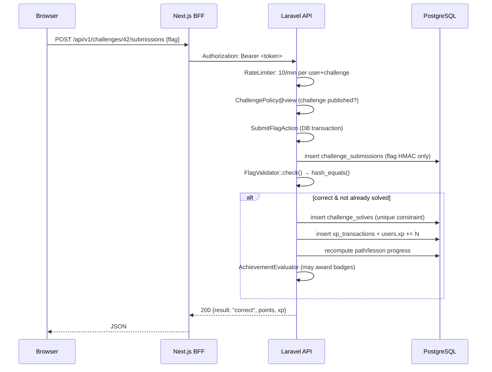

# Catch The Flag — Architecture

> Version: 1.0 (V1) · Status: authoritative for V1 implementation

This document defines the technical architecture of **Catch The Flag (CTF)**, a
cybersecurity learning and CTF platform. It is the reference for all
implementation work. Where this document and code disagree, this document must
be updated in the same change.

---

## 1. High-level overview

Catch The Flag is a monorepo containing two applications and shared
infrastructure:

```
Browser
   │  (same-origin, httpOnly session cookie)
   ▼
Next.js Web App  ──── BFF proxy / route handlers ────►  Laravel API (/api/v1)
   │  (SSR + client components)                            │
   │                                                       ▼
   │                                              PostgreSQL 17
   │                                              (source of truth)
   │                                                       │
   └── static assets / UI                    File storage abstraction
                                             (local disk | S3-compatible)
```

**V1 scope reminder:** static / file-based challenges + structured learning
paths only. No live machines, no Docker labs, no VPN, no interactive targets.
See [product.md](product.md) and [roadmap.md](roadmap.md).

---

## 2. Technology stack

| Layer | Technology | Notes |
|---|---|---|
| Frontend | Next.js (App Router), TypeScript, React, Tailwind CSS, shadcn/ui | Server/client boundaries used intentionally |
| Backend | Laravel (PHP 8.4), REST API under `/api/v1` | Thin controllers, application actions, domain services |
| Auth | Laravel Sanctum personal access tokens | Token issued by API, held **server-side** by the web app (see §6) |
| Database | PostgreSQL 17 | Relational schema, generated full-text search vectors |
| Cache / rate limits | Laravel cache, `database` driver by default, Redis optional | Redis only where it earns its keep |
| Queue | `database` / `sync` | No queue infra required in V1 |
| File storage | Laravel filesystem abstraction | `local` dev, S3-compatible production (env-driven) |
| Local infra | Docker Compose | PostgreSQL (+ optional Redis) and the API runtime container |
| Reverse proxy | Provider-agnostic (nginx / Caddy / Traefik) | See [deployment.md](deployment.md) |

Version pins live in `apps/web/package.json` and `apps/api/composer.json`.

---

## 3. Repository structure

```
/
├── apps/
│   ├── web/                  # Next.js frontend (BFF + UI)
│   └── api/                  # Laravel backend (REST API)
├── docs/
│   ├── architecture.md       # this file
│   ├── product.md            # product vision, V1/V2/V3
│   ├── database.md           # schema / ERD / constraints
│   ├── api.md                # API contract
│   ├── security.md           # threat model & controls
│   ├── development.md        # dev workflow, conventions, commands
│   ├── deployment.md         # production deployment
│   ├── roadmap.md            # versioned roadmap
│   └── decisions/            # ADRs
├── infra/
│   ├── docker/               # Dockerfiles & container config
│   └── deployment/           # sample proxy/deploy configs
├── scripts/                  # dev/CI helper scripts
├── .env.example
├── AGENTS.md
├── README.md
└── docker-compose.yml        # local dev services
```

### 3.1 Why a monorepo

A single repository keeps schema, API contract, frontend, and documentation in
lockstep during V1 when the team and cadence are small. ADR-0001.

---

## 4. Backend architecture (Laravel)

Layering (each layer only talks to the layer below it):

```
HTTP Layer      Controllers (thin) + FormRequests + API Resources
      ↓
Application     Actions / use-cases (one public method, transactional)
      ↓
Domain          Services, Enums, Policies, domain rules (XP, progress, flags)
      ↓
Persistence     Eloquent models (thin), repositories NOT used (YAGNI in V1)
      ↓
Infrastructure  Filesystem disks, cache, mail, rate limiter
```

### 4.1 Directory conventions

```
apps/api/app/
├── Actions/            # use-cases: SubmitFlag, AwardXp, PublishChallenge...
├── Services/           # domain services: FlagValidator, ProgressCalculator,
│                       # LeaderboardService, AuditLogger, AchievementEvaluator
├── Enums/              # Status, Difficulty, XpReason, SubmissionResult...
├── Policies/           # authorization rules per model
├── Models/             # Eloquent models (no business logic)
├── Http/
│   ├── Controllers/Api/V1/   # thin: validate → action → resource
│   ├── Requests/             # FormRequest validation rules
│   ├── Resources/            # output shaping (NEVER expose secrets)
│   └── Middleware/            # cross-cutting concerns
└── Providers/
```

### 4.2 Rules

- Controllers contain **no business logic**; they delegate to Actions.
- Actions are single-purpose, wrap writes in DB transactions, and are the only
  layer allowed to mutate multiple aggregates.
- Policies decide **all** authorization. `authorize()` is called before any
  write. Never trust request fields for ownership/permissions.
- API Resources define the **only** serialization path. Flags, password hashes,
  internal paths, and audit payloads never enter a resource.
- Eloquent models hold relationships, casts, scopes, and small helpers only.
- No "helper dump" files. Domain concepts get explicit names
  (`FlagSubmissionLimiter`, not `Utils`).

### 4.3 Future extension: labs (V2+)

Challenge solving is funneled through a single application action
(`SubmitFlagAction`) that resolves a **flag validator strategy** by
`challenges.flag_validation_type`:

| Type | V1 | Description |
|---|---|---|
| `static` | ✅ implemented | constant flag, HMAC-compared server-side |
| `per_user` | ❌ V2 | flag unique per user (documented, not implemented) |
| `per_instance` | ❌ V2 | flag injected into a lab instance |
| `dynamic` | ❌ V2 | computed by a lab provider |

This enum + strategy registry is the **only** lab-related abstraction built in
V1. Lab entities (machines, instances, providers, VPN sessions) are explicitly
**not** implemented — see [roadmap.md](roadmap.md).

---

## 5. Frontend architecture (Next.js)

```
apps/web/
├── app/                      # App Router routes
│   ├── (public)/             # home, challenges, paths, leaderboard, auth
│   ├── (auth)/               # login, register
│   ├── (app)/                # dashboard, progress, solves, profile, settings
│   ├── admin/                # admin panel (server-side role gate)
│   └── api/                  # BFF route handlers (proxy to Laravel)
├── components/               # feature components (ui/ = primitives)
├── lib/                      # api client, types, utils, auth helpers
└── styles/
```

Principles:

- **Server Components by default.** Client components only where interactivity
  requires it (forms, filters, submit widget, admin editors).
- The browser **never talks to Laravel directly**. All API traffic goes through
  Next.js route handlers (BFF) — see §6.
- The BFF layer is a thin, mechanical proxy: read session cookie → forward
  `Authorization: Bearer <token>` to Laravel → stream JSON back. It adds no
  business logic.
- Design system: dark-first, professional, restrained accent palette; original
  identity (not a HTB/THM clone). Accessibility (keyboard, focus, contrast,
  ARIA) is a requirement, not a polish step.

---

## 6. Authentication & session flow

**Chosen model: API tokens + BFF cookie (ADR-0004).**

```
1. POST /api/v1/auth/login            (via Next.js BFF)
2. Laravel validates credentials → issues Sanctum personal access token
3. BFF stores token in httpOnly, SameSite=Lax cookie (ctf_session)
4. Every subsequent request:
      browser ──same-origin──► Next.js BFF ──Authorization: Bearer──► Laravel
5. Logout: BFF revokes token (Laravel) + clears cookie
```

Properties:

- Token is **never readable by JavaScript** (no localStorage), so XSS cannot
  exfiltrate it directly.
- Laravel sees stateless Bearer auth → **no CSRF surface on the API**; the
  cookie is only ever consumed server-side. Laravel still registers its CSRF
  middleware for any non-API routes (none in V1).
- Strict CORS is effectively moot (browser only talks to Next.js), but Laravel
  sends an explicit allowlist anyway as defense in depth.
- Cross-origin requests to the BFF are rejected via Origin/Host checks.

Roles (V1 RBAC): `user` → `moderator` → `admin`, stored on `users.role`
(ADR-0003). Policies map role → ability. Custom role definitions are a V2
concern.

---

## 7. Request lifecycle (example: flag submission)



Nothing about the flag itself ever crosses the wire after submission, and the
submitted flag is only ever stored as an HMAC.

---

## 8. Key subsystems

### 8.1 Flag validation
- Stored as `flag_ciphertext` (AES-256-GCM via Laravel Crypt) **and**
  `flag_hash` (HMAC-SHA256 with app key). Comparison uses `hash_equals()` on
  the HMAC. Plaintext is never logged, never serialized, never shipped to the
  client. Details: [security.md](security.md).

### 8.2 File storage
- Challenge files live on a dedicated `challenge-files` disk (local root or
  S3-compatible endpoint, chosen by env). Storage keys are server-generated
  UUIDs — client filenames are metadata only.
- Downloads go through an **authorized endpoint** that checks challenge
  visibility and streams via `Storage::download()`. No direct object URLs, no
  public paths, no execution ever.

### 8.3 XP & scoring (server-side only)
- All XP is minted inside `xp_transactions` by application actions; `users.xp`
  is a denormalized, transactionally-maintained mirror used for ranking.
- Award for a solve = `challenge.points − Σ(hint costs used by that user)`
  (floored at 0). Leaderboard order: `xp DESC, solved_count DESC, id ASC`
  (fully deterministic — see database.md §7).

### 8.4 Progress
- Completion rules are deterministic and documented in
  [database.md §8](database.md#8-completion-rules). Progress rows are written
  by explicit actions; derived values are recomputed, never accepted from the
  client.

### 8.5 Search & filtering
- V1: PostgreSQL `tsvector` generated columns + GIN indexes (title/description/
  scenario), plus structured filters (category, difficulty, points, tags,
  solved-state). No search engine service. The query layer is isolated in one
  service so a future Meilisearch/ES swap does not touch controllers.

### 8.6 Audit logging
- `AuditLog` records every administrative mutation: actor, action, entity,
  redacted before/after diff, IP, user agent. Written by `AuditLogger` from
  within admin actions. Secrets (flags, passwords) are redacted before persist.

---

## 9. Cross-cutting concerns

| Concern | Approach |
|---|---|
| Validation | FormRequest classes; strict `exists`/`enum` rules; no mass-assignment of guarded fields |
| Authorization | Policies + server-side role checks; IDOR covered by policies on every read/write of user-owned data |
| Rate limiting | Laravel RateLimiter (cache): auth, submissions, downloads, admin writes — numbers in `config/ctf.php` |
| Errors | Consistent JSON envelope + `request_id` for correlation; generic messages for 401/403/404/429/500 |
| Logging | Monolog JSON-ish context; structured; no secrets; health endpoint `/api/v1/health` |
| Migrations | All schema in versioned migrations; seeds for demo/admin content |
| Config | Env-driven; `.env.example` documents every knob; secrets never committed |

---

## 10. Deployment topology (target)

See [deployment.md](deployment.md) for the full guide. Summary:

```
Internet → TLS terminator / reverse proxy
             ├── Next.js (node, SSR) ─┐
             └── /api/* → Laravel FPM │ (or Laravel Octane later)
                                       ▼
                        PostgreSQL (managed or self-hosted)
                        S3-compatible object storage
                        Redis (optional: cache/rate-limits at scale)
```

Stateless app servers; no user-specific infrastructure in V1. Lab orchestration
(K8s, per-user containers) is explicitly out of scope until V2+ (roadmap).

---

## 11. Testing architecture

- **Backend:** PHPUnit feature tests (HTTP layer), unit tests (services/actions),
  dedicated authorization, file-security, rate-limit, and flag-submission suites.
- **Frontend:** Vitest + React Testing Library component tests; MSW-driven
  integration tests for critical flows (login, challenge solve, progress).
- CI runs: lint → typecheck → backend tests → frontend tests.
  Commands in [development.md](development.md).

---

## 12. Explicitly out of scope (V1)

Live machines, VPS, Docker labs, VPN, pentest targets, AD labs, browser Kali,
web exploitation sandboxes, shells, container orchestration, Kubernetes. These
are documented as **future extension points only** (§4.3) and must not be
scaffolded in V1 code.
