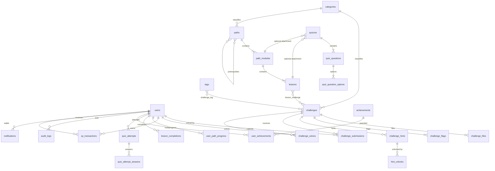

# Catch The Flag — Database Design

> PostgreSQL 17 · Source of truth for the entire platform
> Companion docs: [architecture.md](architecture.md) · [security.md](security.md)

All tables use `id BIGINT GENERATED ALWAYS AS IDENTITY PRIMARY KEY` (or explicit
composite PKs for pivots), `created_at` / `updated_at` timestamps, and foreign
keys with `ON DELETE` behavior spelled out. Slugs are used wherever public URLs
require them. Soft deletes (`deleted_at`) are used only where historical
integrity matters (users, challenges, paths).

---

## 1. ERD (core V1)



---

## 2. Identity & access

### `users`
| Column | Type | Notes |
|---|---|---|
| id | bigint PK | |
| name | varchar(80) NOT NULL | display name, public |
| email | citext UNIQUE NOT NULL | login identity |
| email_verified_at | timestamptz NULL | V1: optional verification |
| password | varchar(255) NOT NULL | Argon2id hash, never selected in API |
| role | varchar(20) NOT NULL DEFAULT `'user'` | CHECK IN (`user`,`moderator`,`admin`) — ADR-0003 |
| xp | bigint NOT NULL DEFAULT 0 | denormalized ranking mirror, CHECK (xp >= 0) |
| solved_count | int NOT NULL DEFAULT 0 | denormalized, maintained in solve transaction |
| bio | varchar(500) NULL | profile |
| avatar_path | varchar(255) NULL | storage key, not a URL |
| preferences | jsonb NULL | non-sensitive prefs (e.g. `{ "theme": "system"|"light"|"dark" }`); never mass-assignable |
| banned_at | timestamptz NULL | soft kill-switch for abuse |
| last_login_at | timestamptz NULL | |
| remember_token | — | not used (token auth) |
| deleted_at | timestamptz NULL | soft delete |

Indexes: `UNIQUE(email)`, `INDEX(role)`, `INDEX(xp DESC, solved_count DESC, id ASC)`
(partial `WHERE deleted_at IS NULL` for leaderboard).

**Why `xp`/`solved_count` are denormalized:** leaderboard queries must stay a
single indexed scan at 10k+ users. Both are updated only inside the same DB
transaction that inserts `xp_transactions` / `challenge_solves` — no drift is
possible. Rule: *clients can never write these columns.*

### Sessions / tokens
Sanctum `personal_access_tokens` (standard table): token id, `tokenable` morph,
name, `token` (hashed), abilities, last_used_at, expires_at. Raw tokens are
returned exactly once (at login/register) and only stored hashed.

---

## 3. Taxonomy (categories & tags)

### `categories`
| Column | Type | Notes |
|---|---|---|
| id | PK | |
| name | varchar(80) NOT NULL | e.g. "Digital Forensics / DFIR" |
| slug | varchar(80) UNIQUE NOT NULL | URL key, e.g. `dfir` |
| description | varchar(500) NULL | |
| color | varchar(9) NULL | `#RRGGBB` for UI chip |
| icon | varchar(60) NULL | named icon, not file upload |
| sort_order | int NOT NULL DEFAULT 0 | |
| is_active | boolean NOT NULL DEFAULT true | hidden categories disappear everywhere |

V1 seeds: `soc`, `dfir`, `network-forensics`, `malware-analysis`,
`reverse-engineering`, `cryptography`, `osint`, `steganography`. New categories
are pure data → **no code change to add one** (ADR-0005).

### `tags`
`id, name, slug UNIQUE, created_at`. Pivot `challenge_tag (challenge_id, tag_id)`
with composite PK + index on `tag_id`.

---

## 4. Learning paths

### `paths`
| Column | Type | Notes |
|---|---|---|
| id | PK | |
| title | varchar(160) NOT NULL | |
| slug | varchar(160) UNIQUE NOT NULL | |
| summary | varchar(400) NOT NULL | card copy |
| description | text NULL | long markdown |
| thumbnail_path | varchar(255) NULL | storage key (images only) |
| category_id | bigint FK → categories ON DELETE SET NULL NULL | |
| difficulty | varchar(20) NOT NULL | CHECK IN (`beginner`,`intermediate`,`advanced`,`expert`) |
| estimated_minutes | int NOT NULL DEFAULT 0 CHECK (>= 0) | |
| status | varchar(20) NOT NULL DEFAULT `'draft'` | CHECK IN (`draft`,`review`,`published`,`archived`) |
| published_at | timestamptz NULL | set when status → published |
| created_by | bigint FK → users ON DELETE SET NULL | |
| deleted_at | timestamptz NULL | |

Indexes: `UNIQUE(slug)`, `INDEX(status, published_at)`, `INDEX(category_id)`,
GIN `search_vector` (generated: title+summary+description).

### `path_prerequisites`
`(path_id, prerequisite_path_id)` composite PK, both FKs → paths
(`ON DELETE CASCADE`), `CHECK (path_id <> prerequisite_path_id)`.
Optional — V1 does not hard-block on prerequisites, it *displays* them
(documented product rule).

### `path_modules`
`id, path_id FK CASCADE, title, description, position int, is_published bool
DEFAULT true`, `UNIQUE(path_id, id)` implied by FK; index `(path_id, position)`.
Ordering is deterministic: `ORDER BY position, id`.

### `lessons`
| Column | Type | Notes |
|---|---|---|
| id | PK | |
| module_id | FK → path_modules CASCADE | |
| title | varchar(160) NOT NULL | |
| slug | varchar(160) NOT NULL | `UNIQUE(module_id, slug)` |
| content | text NOT NULL | markdown source |
| summary | varchar(400) NULL | |
| estimated_minutes | int NOT NULL DEFAULT 0 | |
| position | int NOT NULL | index `(module_id, position)` |
| is_published | boolean NOT NULL DEFAULT true | |
| is_challenge_embedded | boolean derived at query time — NOT stored | |

Pivot `lesson_challenge (lesson_id, challenge_id)` composite PK, index on
`challenge_id`. **A challenge can belong to 0..n lessons and still exist
standalone** — never FK a challenge to a single lesson (spec §9).

### Completion semantics
See §8.

---

## 5. Quizzes

### `quizzes`
`id, title, description, pass_score int DEFAULT 70` (percent, CHECK 1..100),
`position int, is_published bool, module_id FK NULL, lesson_id FK NULL`,
`CHECK ((module_id IS NOT NULL) <> (lesson_id IS NOT NULL))` — attached to
exactly one parent (XOR).

### `quiz_questions`
`id, quiz_id FK CASCADE, question text, type varchar(16) CHECK IN ('single',
'multiple','true_false'), explanation text NULL, points int DEFAULT 1 CHECK > 0,
position int, is_published bool`.

### `quiz_question_options`
`id, question_id FK CASCADE, option_text text, is_correct bool DEFAULT false,
position int`. Exactly one correct option for `single`/`true_false` (enforced in
action + test), ≥2 for `multiple`.

### `quiz_attempts`
`id, user_id FK, quiz_id FK, score int (0..100), passed bool,
started_at, completed_at timestamptz NULL`. Index `(user_id, quiz_id, score DESC)`.
**Completion rule:** a quiz counts as completed when the user has ≥1 attempt
with `passed = true` (best attempt wins). Answers:

### `quiz_attempt_answers`
`id, attempt_id FK CASCADE, question_id FK, selected_option_ids int[] NOT NULL,
is_correct bool NOT NULL`. `UNIQUE(attempt_id, question_id)`.

Scoring happens server-side in the attempt-completion action; the client never
sends scores.

---

## 6. Challenges (core CTF domain)

### `challenges`
| Column | Type | Notes |
|---|---|---|
| id | PK | |
| title | varchar(160) NOT NULL | |
| slug | varchar(160) UNIQUE NOT NULL | |
| description | text NOT NULL | markdown, shown to player |
| scenario | text NULL | longer brief |
| category_id | bigint FK → categories RESTRICT NOT NULL | |
| difficulty | varchar(20) NOT NULL CHECK IN (4 levels) | |
| points | int NOT NULL DEFAULT 100 CHECK (points BETWEEN 1 AND 10000) | |
| estimated_minutes | int NOT NULL DEFAULT 30 | |
| status | varchar(20) NOT NULL DEFAULT `'draft'` CHECK IN (`draft`,`review`,`published`,`archived`) | |
| flag_validation_type | varchar(20) NOT NULL DEFAULT `'static'` CHECK IN (`static`,`per_user`,`per_instance`,`dynamic`) | **V1 implements `static` only** — extension point |
| author_id | bigint FK → users SET NULL | |
| published_at | timestamptz NULL | |
| solve_count | int NOT NULL DEFAULT 0 | denormalized, transaction-maintained |
| max_attempts | int NULL | NULL = unlimited (rate limiter still applies) |
| deleted_at | timestamptz NULL | |
| created_at / updated_at | | |

Indexes: `UNIQUE(slug)`, `(category_id)`, `(difficulty)`, `(status, published_at)`,
`(points)`, GIN `search_vector` (title+description+scenario).
`search_vector` is a **generated stored column** (no triggers):
```sql
search_vector tsvector GENERATED ALWAYS AS (
  to_tsvector('simple', coalesce(title,'') || ' ' || coalesce(description,'') || ' ' || coalesce(scenario,''))
) STORED
```

### `challenge_flags`
| Column | Type | Notes |
|---|---|---|
| id | PK | |
| challenge_id | FK CASCADE | one challenge → many accepted flags (variants) |
| label | varchar(80) NULL | e.g. "primary", "alt format" |
| flag_ciphertext | text NOT NULL | AES-256-GCM (Laravel Crypt) — admin display only |
| flag_hash | char(64) NOT NULL | HMAC-SHA256(app key, normalized flag) — lookup/compare |
| case_sensitive | boolean NOT NULL DEFAULT true | normalization rule applied before hash |
| is_active | boolean NOT NULL DEFAULT true | retire a flag without deleting history |
| created_at / updated_at | | |

`UNIQUE(challenge_id, flag_hash)`. **Never plaintext, never logged, never in any
API response** (see security.md §5). Every check is
`hash_equals($storedHash, hmac($submitted))`.

### `challenge_hints`
`id, challenge_id FK CASCADE, content text, cost_points int NOT NULL DEFAULT 0
CHECK (>= 0), position int`. Revealing a hint costs points from that challenge's
award (floored at 0) — see §7.

### `hint_unlocks`
`id, user_id FK, challenge_id FK, hint_id FK CASCADE, points_cost int,
created_at`, `UNIQUE(user_id, hint_id)`. Idempotent: unlocking twice changes
nothing (no double penalty).

### `challenge_files`
| Column | Type | Notes |
|---|---|---|
| id | PK | |
| challenge_id | FK CASCADE | |
| original_name | varchar(255) NOT NULL | **metadata only**, sanitized, never used as a path |
| storage_disk | varchar(40) NOT NULL | e.g. `challenge-files` |
| storage_key | varchar(255) NOT NULL UNIQUE | server-generated: `{uuid}/{uuid}.{ext}` |
| mime_type | varchar(120) NOT NULL | detected server-side via finfo — never client-provided |
| size_bytes | bigint NOT NULL CHECK (> 0) | |
| checksum_sha256 | char(64) NOT NULL | integrity + dedup evidence |
| visibility | varchar(20) NOT NULL DEFAULT `'private'` CHECK IN (`private`,`authenticated`) | V1: downloads require challenge visibility |
| created_at / deleted_at | | |

Index `(challenge_id)`. Downloads: `GET /challenges/{challenge}/files/{file}`
→ policy check → `Storage::disk(...)->download($storage_key, $original_name)`.
**No public URLs ever. Files are never executed, extracted, or opened by the
server.** (security.md §6)

### `challenge_submissions` (immutable audit of attempts)
`id, challenge_id FK, user_id FK, flag_hash char(64) NOT NULL` (HMAC of the
submission — **plaintext flag is not stored**), `is_correct boolean NOT NULL`,
`ip_address inet NULL`, `user_agent varchar(255) NULL`, `created_at`.
Indexes: `(challenge_id, created_at)`, `(user_id, created_at DESC)`,
`(user_id, challenge_id, is_correct)`.
Used for abuse analysis, rate-limit forensics, and first-blood timestamps.

### `challenge_solves`
`id, challenge_id FK, user_id FK, points_awarded int CHECK (>= 0),
hints_used int NOT NULL DEFAULT 0, solved_at timestamptz NOT NULL DEFAULT now(),
created_at`. **`UNIQUE(challenge_id, user_id)`** — the DB, not app code, is the
final guard against duplicate solves. Insert inside a transaction together with
`xp_transactions`, `users.xp`, `users.solved_count`, `challenges.solve_count`.

---

## 7. XP, leaderboard, achievements

### `xp_transactions` (append-only ledger)
`id, user_id FK, amount int NOT NULL (signed), reason varchar(40) CHECK IN
('challenge_solve','quiz_pass','lesson_complete','path_complete','achievement',
'admin_adjustment'), reference_type varchar(80) NULL, reference_id bigint NULL,
note varchar(200) NULL, created_at`.
Index `(user_id, created_at DESC)`. **No client-writable path exists.** The
current balance is `users.xp` (kept in sync transactionally); the ledger is the
audit trail. `admin_adjustment` entries record who adjusted XP (via actor in
audit log).

**Award formula (solve):**
`points_awarded = max(0, challenge.points − Σ hint_unlocks.cost_points for this
user+challenge)`. XP gained equals `points_awarded`.

### Leaderboard (deterministic, documented)
Ranking SQL:
```sql
SELECT ... FROM users
WHERE deleted_at IS NULL AND banned_at IS NULL
ORDER BY xp DESC, solved_count DESC, id ASC
LIMIT :per OFFSET :offset
```
Ties are impossible to flip between requests (fully deterministic ordering).
V1 = global all-time only. Weekly/monthly/event boards are V2 (roadmap) and
will be derived from `xp_transactions.created_at` — no schema change needed.

### `achievements`
`id, key varchar(80) UNIQUE NOT NULL, title, description, icon varchar(60),
criteria_type varchar(40) CHECK IN ('solves_total','xp_total',
'paths_completed','category_solves','first_blood'),
criteria jsonb NOT NULL DEFAULT '{}'` (e.g. `{"threshold":10}`),
`points int DEFAULT 0, is_active bool DEFAULT true, sort_order int`.

Criteria **config** is JSON because it is configuration, not relational data
(ADR-0006); the *evaluation logic* is typed PHP in `AchievementEvaluator`.

### `user_achievements`
`id, user_id FK, achievement_id FK, awarded_at timestamptz`,
`UNIQUE(user_id, achievement_id)`.

---

## 8. Progress

### `user_path_progress`
`id, user_id FK, path_id FK, status varchar(20) CHECK IN ('in_progress',
'completed'), started_at, completed_at NULL, UNIQUE(user_id, path_id)`.

### `lesson_completions`
`id, user_id FK, lesson_id FK CASCADE, completed_at timestamptz`,
`UNIQUE(user_id, lesson_id)`.

### Completion rules (deterministic — authoritative)

| Entity | Completed when |
|---|---|
| **Lesson** | `lesson_completions` row exists (explicit "mark complete" POST; a lesson with no linked challenge/quiz can be marked immediately) |
| **Quiz** | ≥1 `quiz_attempts` with `passed = true` |
| **Challenge** | row exists in `challenge_solves` |
| **Module** | all published lessons in module completed **AND** all quizzes attached to module passed **AND** all challenges linked to module's lessons solved |
| **Path** | every **published** module in the path completed **AND** every published challenge linked to any lesson of the path solved **AND** path-level quizzes (if any) passed |

Recomputation is done server-side after each relevant event (solve, lesson
complete, quiz pass) via `ProgressCalculator`. Progress rows are only ever
written by application actions — never by client-supplied booleans.

`started_at` is set on first `POST /paths/{path}/start` (idempotent upsert).

---

## 9. Notifications & audit

### `notifications` (Laravel database notifications)
`id uuid PK, type varchar(80), notifiable_type/id, data jsonb, read_at NULL,
created_at`. V1 triggers: achievement earned, path completed. Data payload is
UI copy only — no flags, no secrets.

### `audit_logs`
| Column | Type | Notes |
|---|---|---|
| id | PK | |
| actor_id | bigint FK NULL | null for system jobs |
| action | varchar(80) NOT NULL | dotted verbs: `challenge.create`, `challenge.publish`, `user.role_change`, `flag.update` |
| auditable_type | varchar(80) NOT NULL | model class alias (`challenge`) |
| auditable_id | bigint NULL | |
| changes | jsonb NULL | redacted before/after diff — **flags/passwords redacted to `"***"`** |
| ip_address | inet NULL | |
| user_agent | varchar(255) NULL | |
| created_at | timestamptz | (no updated_at — append-only) |

Indexes: `(created_at DESC)`, `(auditable_type, auditable_id)`, `(actor_id,
created_at DESC)`, `(action)`.

---

## 10. Constraints & integrity summary

- All FKs declared; `CHECK` constraints back every enum-ish status column so
  the DB rejects invalid states even if app validation is bypassed.
- Uniqueness: `users.email`, `paths.slug`, `challenges.slug`, `tags.slug`,
  `categories.slug`, `challenge_solves(user_id, challenge_id)`,
  `user_achievements(user_id, achievement_id)`,
  `lesson_completions(user_id, lesson_id)`,
  `user_path_progress(user_id, path_id)`,
  `hint_unlocks(user_id, hint_id)`,
  `challenges.challenge_flags(challenge_id, flag_hash)`.
- Denormalized counters (`users.xp`, `users.solved_count`,
  `challenges.solve_count`) are written **only** inside the transaction that
  creates the source event, with `CHECK >= 0`.
- Soft deletes only on `users`, `paths`, `challenges` (content must stay
  referentially resolvable after deletion).
- `citext` extension used for emails (case-insensitive uniqueness).

---

## 11. Future entities (documented, NOT implemented)

Labs · Lab Templates · Lab Instances · Machines · Lab Providers · VPN Sessions
· Teams · CTF Events · Courses · Certificates · Weekly/event leaderboards.

These will be added as new tables in V2+; no V1 table depends on them, so no
core rewrite is required. See [roadmap.md](roadmap.md).
